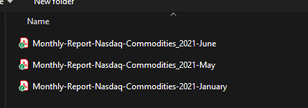
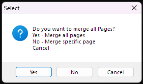
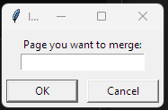

<p align="right"><a href="https://github.com/ojudz08/AutomationProjects/tree/main">Back To Main Page</a></p>


<!-- PROJECT LOGO -->
<br />
<div align="center">
<h1 align="center">PDF Merger</h1>
</div>


<!-- ABOUT PROJECT -->
### About

This is a project where it:
1. Merge all the pdf pages
2. Merge only the 1st pdf page

File to merge is a pdf. Once pdf_merger.exe file is created, ynou can run it to open the file to merge. Merged pdf file is save as a pdf.

### Requirements

This project was created and tested in an isolated conda venv within VsCode. To create the conda venv, go to this link for instructions [Python environments in VS Code](https://code.visualstudio.com/docs/python/environments)

   ```Python version 3.11.9```


Run each command below to install the necessary packages and create the executable file **pdf_merger.exe**. 

```powershell
python -m pip install -r requirements.txt
pyinstaller main.py --clean --onefile --name pdf_merger -y
python scripts/file_transfer.py
```

Or simply run the **run.bat** within the VsCode's terminal which also contains the commands to run.

```bat
@echo off
echo Install requirements...
python -m pip install -r requirements.txt

echo Create pdf_merger.exe...
pyinstaller main.py --clean --onefile --name pdf_merger -y

python scripts/file_transfer.py
```


### Running the Script
1. Save your reports within __*reports*__ folder.

2. This will install all the necessary python libraries used.
   ```powershell
   python -m pip install -r requirements.txt
   ```

3. Create an executable file pdf_merger.exe from the main.py
   ```powershell
   pyinstaller main.py --clean --onefile --name pdf_merger -y
   ```

4. Move the created executable file in the current directory.
   ```powershell
   python scripts/file_transfer.py
   ```


### How to use pdf_merger
1. After running the script above, you will see a **_pdf_merger_** application.

2. Once you run the application, it will prompt you to select the pdf files you want to merge.

   

3. After selecting the files to merge, select the options Yes, No or Cancel.

   

   - Select Yes if you want to merge all the pages on all the files selected. 
   - Select No if you want to merge specific pages only

     

   - Cancel if you want to cancel merging any pages.

4. Save the file.


<!-- CONTACT -->
### Disclaimer

This project was created using Windows, the run.bat will only work with Windows. Please contact Ojelle Rogero - ojelle.rogero@gmail.com for any questions with email subject "Github Parsing PDFs".
